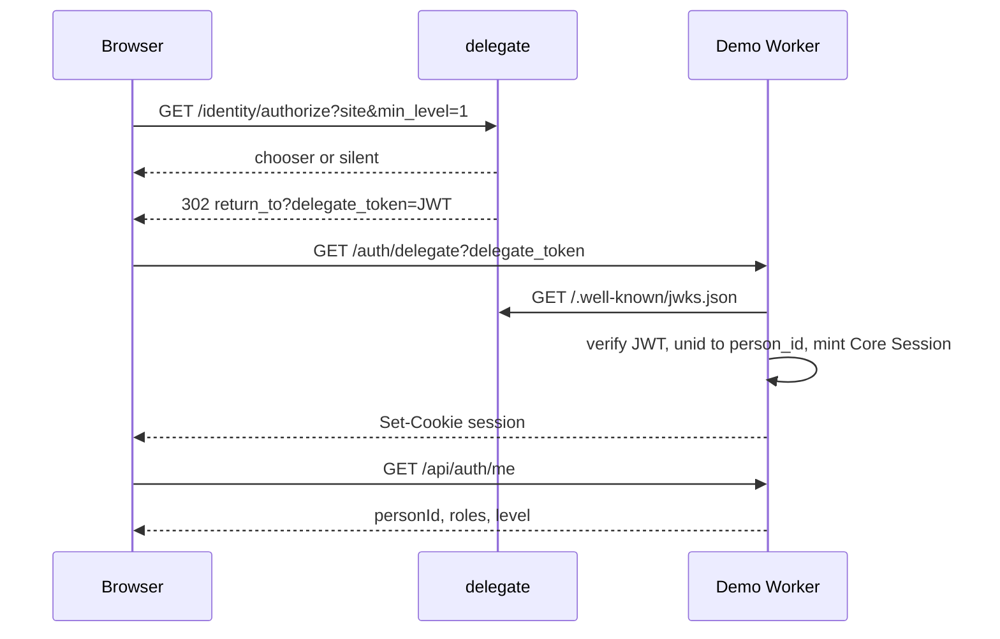

# Festival demo — identity flow

The demo is an Astro + Cloudflare Worker Site that embeds `@engine9/core`
and `@engine9/id`. Protocol: [`id/docs/protocol.md`](../../id/docs/protocol.md).

## Roles (example)

Defined in `src/lib/engine9.ts`:

- **VIP** — segment `5f2ab45c-0a39-4939-a2af-c1fcc58f37ff`, scopes
  `data:read`, `requiredAuth.minLevel = 1` (self-asserted profile enough
  for lounge personalization).
- **Admin** — segment `4f4ac886-f53d-48e1-b4bd-5a98eb48cc6f`, scopes
  `admin`, `requiredAuth.minLevel = 3` (trusted provider).

`loadRolesOnLogin: false` so every login hits `/choose-role`.

## Sequence (Identity Token)

Legacy `delegate_code` / `delegate_bridge` still work on the same callback.

## Client vs server

- `@engine9/id` on `/login`: Identity Token popup (`requestIdentity`),
  Level 0 probe, then `GET /auth/delegate?delegate_token=`.
- Server: JWT verify, person pipeline, HttpOnly `session` cookie,
  middleware for `/vip` and `/admin` (also checks `requiredAuth.minLevel`).
- Level 1 register: `/auth/register` → `POST /api/people` with the seeded
  `e9publickey_` (`public` + `people:write`). The private `e9key_` stays
  server-only for admin-style API calls.
